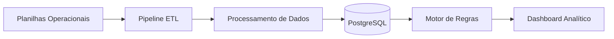

# Workforce Planning & Schedule Audit Platform

Sistema web para planejamento, auditoria e análise de escalas operacionais, com detecção automática de conflitos de horário, violações de folga e riscos logísticos de deslocamento.

A plataforma processa planilhas operacionais, consolida os dados em um pipeline ETL e aplica regras de negócio para identificar riscos operacionais e problemas de planejamento em equipes de produção.

---


# Visão Geral

Operações de produção esportiva envolvem centenas de atividades simultâneas distribuídas entre profissionais, eventos e cidades.

Gerenciar escalas manualmente pode gerar problemas como:

- sobreposição de atividades
- trabalho em dias de folga
- deslocamentos inviáveis entre cidades
- descanso insuficiente entre jornadas
- falta de cobertura em eventos futuros

Esta plataforma foi desenvolvida para **automatizar a auditoria e o planejamento dessas escalas**, permitindo identificar riscos operacionais antes que afetem a operação.

---


# Principais Funcionalidades

## Upload e Processamento de Dados

O sistema recebe planilhas operacionais e executa automaticamente um pipeline de processamento.

Fontes suportadas:

- Relatório **2468 – Atividades de Equipe**
- Relatório **2020 – Gestão de Eventos Consolidado**

Processamento realizado:

- normalização de dados
- consolidação de atividades
- merge inteligente por WO + data
- cálculo de duração com suporte a virada de dia
- enriquecimento de dados de eventos

---

## Detecção Automática de Alertas

A plataforma aplica regras de negócio para identificar riscos operacionais.

### Conflitos de Horário

Detecta sobreposição de atividades para a mesma pessoa.

- cálculo do tempo de overlap
- identificação de eventos conflitantes
- rastreamento de atividades sobrepostas

---

### Violações de Folga

Detecta atividades agendadas em dias de:

- folga
- férias
- compensação

O sistema bloqueia automaticamente o dia completo como indisponível.

---

### Riscos de Deslocamento

Identifica situações em que o tempo entre atividades em cidades diferentes é insuficiente.

Regras aplicadas:

- detecção automática de mudança de cidade
- cálculo do tempo entre atividades
- alerta quando gap < 3 horas (configurável)

---

### Alertas de Interjornada

Detecta descanso insuficiente entre jornadas.

Regra aplicada:

```
Descanso mínimo entre jornadas: 11 horas
```

O sistema calcula automaticamente o tempo entre o fim de uma atividade e o início da próxima.

---

### Rastreamento de Viagens

Mudanças de cidade são detectadas automaticamente.

O sistema registra:

- cidade de origem
- cidade de destino
- data da viagem
- profissional envolvido

Isso permite analisar padrões de deslocamento da equipe.

---

# Dashboard Executivo

O sistema disponibiliza um painel analítico com métricas operacionais.

Principais indicadores:

- Total de horas trabalhadas
- Total de eventos processados
- Número de atividades
- Conflitos de horário
- Violações de folga
- Riscos de deslocamento
- Alertas de interjornada
- Mudanças de cidade detectadas

Visualizações incluídas:

- conflitos por semana
- distribuição de horas trabalhadas
- ranking de profissionais com maior número de alertas

---

# Análise de Grade Futura

A plataforma também permite analisar eventos futuros.

O sistema calcula automaticamente a suficiência de profissionais disponíveis considerando:

- folgas
- férias
- exceções (licença médica, maternidade etc.)

Resultado da análise:

- Suficiente
- Insuficiente
- Crítico

Também são geradas recomendações automáticas para ajuste de equipe.

---

# Arquitetura do Sistema



---

# Stack Tecnológica

## Backend

Node.js  
Express  
tRPC  

## Banco de Dados

PostgreSQL / TiDB  

## Processamento de Dados

Pipeline ETL customizado com leitura de planilhas XLSX

## Frontend

React 19  
TypeScript  
Tailwind CSS  
shadcn/ui  

## Visualização de Dados

Recharts

---

# Estrutura do Banco de Dados

Principais tabelas:

```
users
runs
escalas
eventos
alertas_conflito
alertas_folga
alertas_deslocamento
alertas_interjornada
viagens
grades
analise_grades
```

---

# Fluxo de Processamento

1. Upload das planilhas operacionais
2. Execução do pipeline ETL
3. Consolidação e normalização de dados
4. Aplicação das regras de negócio
5. Detecção automática de alertas
6. Persistência dos dados no banco
7. Atualização do dashboard analítico

---

# Testes

O projeto possui cobertura de testes para os principais módulos.

Testes incluem:

- processamento ETL
- detecção de conflitos
- validação de regras de folga
- detecção de riscos de deslocamento
- validação de interjornada
- autenticação

Resultado atual:

```
18 testes passando
```

---

# Possíveis Evoluções

- exportação de alertas em Excel
- integração com Microsoft Teams
- notificações automáticas
- configuração de regras por rota
- dashboard em tempo real
- API pública para integração

---

# Sobre o Projeto

Plataforma desenvolvida para apoiar o planejamento operacional de equipes em ambientes de produção esportiva, automatizando a análise de escalas e reduzindo riscos logísticos e operacionais.
